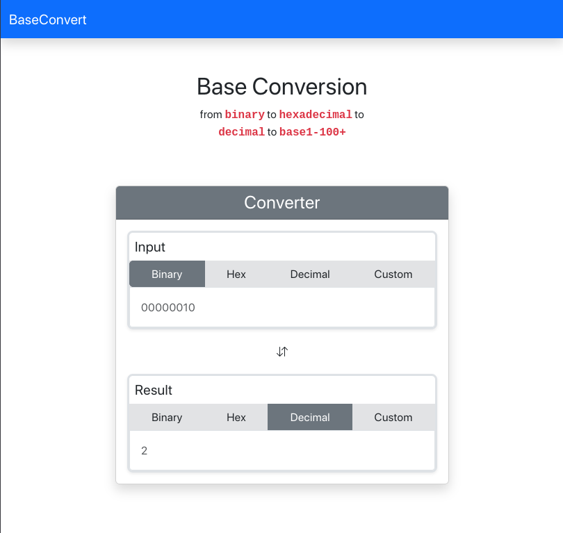

# Base Convert
Web application that converts between binary, hexadecimal, decimal, and any other base

## Tech

- Bootstrap
- CSS
- HTML
- Javscript 

 ## Preview

## Contributing

Pull requests are welcome. For major changes, please open an issue first to discuss what you would like to change.

Please make sure to update tests as appropriate.

# License

[Mit](https://choosealicense.com/licenses/mit/)