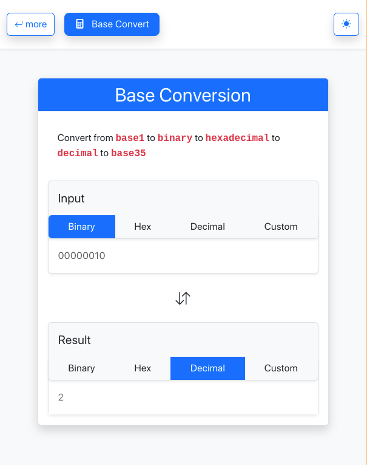

# Base Convert
Web application that converts between binary, hexadecimal, decimal, and any other base

## Live Website
https://joncgroberg.github.io/baseConvert

## Preview

## Features

- Allows users to **convert** between different number bases
  - binary
  - hexadecimal
  - decimal
  - base2 -> base35
- **Animate** conversion icon while the conversion is being performed.
- **Toggle** between light and dark themes.

- Uses a separate module, `calculator.js`, to perform the base conversions by.
    - **decode** the number
    - **convert**  to base 10
    - **convert**  to the destination base
    - **encode** the result

## Tech

- Bootstrap
- CSS
- HTML
- Javscript
  
## Contributing

Pull requests are welcome. For major changes, please open an issue first to discuss what you would like to change.

## License

[Mit](https://choosealicense.com/licenses/mit/)
